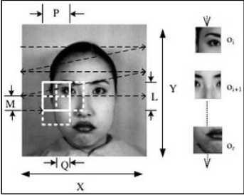
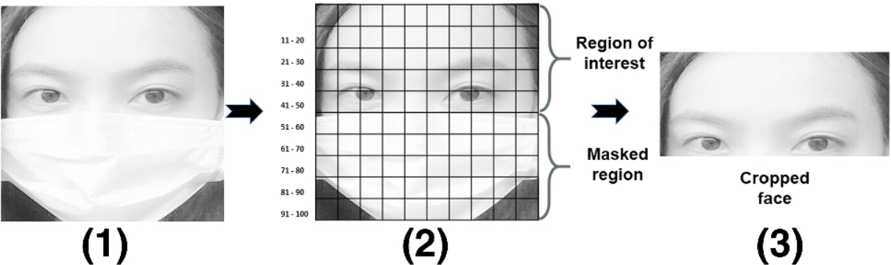

# RAPPORT PFA
# Dédicace : 

Nous tenons à dédier ce rapport à monsieur Mohammed AMEKSA, qui nous a apporté son soutien et ses encouragements tout au long de ce projet. Ses conseils précieux ont été essentiels à notre réussite. Nous remercions également l'EMSI de nous avoir donné l'opportunité de travailler sur ce projet. Leur confiance et leur soutien ont été une source de motivation pour mener à bien ce projet.

# Résumé :

**Face Smart** est un projet de reconnaissance faciale utilisant la bibliothèque Python `face_recognition`. Il permet de détecter et d'identifier des visages pour un système de pointage.

**Fonctionnalités principales :**

- **Détection de visages :** Le projet peut identifier des visages à partir d'un flux vidéo.
- **Reconnaissance faciale :** Le projet peut comparer les visages détectés à une base de données Firebase de visages connus et identifier les personnes correspondantes.

**Technologies utilisées :**

- **Python :** Le langage de programmation principal du projet.
- **face_recognition :** Une bibliothèque Python pour la reconnaissance faciale.
- **OpenCV :** Une bibliothèque Python pour le traitement d'images et de vidéos.
- **Firebase :** Une base de données créée par Google.

**Remarques :**

- La précision de la reconnaissance faciale peut varier en fonction de la qualité de l'image ou de la vidéo, de l'éclairage et de la pose du visage.
- Il est important d'utiliser le projet de manière éthique et responsable. La reconnaissance faciale peut être une technologie puissante, mais elle soulève également des questions importantes concernant la vie privée et la sécurité.

**En résumé, Face Smart est un projet prometteur qui peut être utilisé dans plusieurs sociétés. Il est important de l'utiliser de manière éthique et responsable.**

# Glossaire :

- **Face Smart :** Nom du projet de reconnaissance faciale développé dans le cadre de ce rapport.
- **Reconnaissance faciale :** Technologie permettant d'identifier ou de vérifier l'identité d'une personne à partir de ses caractéristiques faciales uniques.
- **Python :** Langage de programmation utilisé pour développer l'application Face Smart.
- **Bibliothèque Python :** Ensemble de modules ou de packages préécrits qui étendent les fonctionnalités de base de Python.
- **face_recognition :** Bibliothèque Python utilisée pour la reconnaissance faciale dans le projet Face Smart.
- **OpenCV :** Open Source Computer Vision Library, une bibliothèque open-source de vision par ordinateur et de traitement d'images utilisée dans le projet.
- **Firebase :** Plateforme de développement d'applications mobiles et web acquise par Google, utilisée comme base de données pour stocker les visages connus dans le projet Face Smart.
- **Détection de visages :** Processus automatisé permettant de localiser et de délimiter les visages dans une image ou une vidéo.
- **Reconnaissance faciale :** Processus consistant à identifier ou à vérifier l'identité d'une personne en comparant ses caractéristiques faciales avec des visages connus dans une base de données.
- **Yolov8 :** Une architecture de réseau de neurones convolutifs utilisée pour la détection d'objets, notamment les visages, bien qu'elle n'ait pas été retenue pour ce projet en raison de ses exigences en ressources.
- **Précision de la reconnaissance faciale :** La mesure dans laquelle un système de reconnaissance faciale est capable d'identifier correctement les visages dans des conditions variables telles que l'éclairage, l'angle de vue, etc.
- **Éthique et responsabilité :** Les principes et les obligations morales associés à l'utilisation de la technologie de reconnaissance faciale, y compris la protection de la vie privée et des droits individuels.

# Introduction : 

Dans le cadre de notre projet de fin d'année, nous avons décidé de développer une application de pointage en utilisant la reconnaissance faciale. Bien que cette technologie soit largement utilisée dans les domaines liés à la sécurité, elle est rarement vue dans le monde du travail. C'est pourquoi notre application apportera une nouvelle approche au monde du travail en y ajoutant des méthodes plus modernes.

Pour la réalisation de ce projet, nous avons principalement utilisé la reconnaissance faciale. Nous avons eu deux choix : le premier choix était d'entraîner notre propre modèle, mais cette technique présentait quelques inconvénients, notamment en termes de précision, en raison du besoin de ressources matérielles que nous ne possédions pas. Nous nous sommes donc tournés vers le deuxième choix, qui consistait à utiliser un modèle pré-entraîné. Parmi les choix possibles, Yolov8 et face-recognition étaient les plus intéressants. Cependant, Yolov8 demandait énormément de ressources pour un résultat médiocre. Nous avons donc décidé d'utiliser face-recognition, qui présentait l'avantage de ne pas demander beaucoup de ressources et qui était précis.

# Reconnaisance Faciale :

## Historique : 

Contrairement à ce que l'on pourrait penser, les recherches sérieuses sur la reconnaissance faciale ont débuté dans les années 60. Bien que les méthodes étaient rudimentaires et consistaient uniquement en la distance entre le nez et les yeux, elles ont ouvert la voie à une multitude de recherches qui nous ont menés à l'utilisation du Deep Learning dans les années 2010. Cet événement a considérablement amélioré l'efficacité de ce type d'algorithmes.

## Fonctionnement : 

En général, les algorithmes de reconnaissance faciale passent par 4 grandes étapes :

### La Détection :

Les algorithmes de détection faciale utilisent diverses techniques pour localiser les visages dans une image. Parmi celles-ci, les cascades de classifieurs en cascade, comme l'algorithme Viola-Jones, sont populaires. Ils analysent l'image par des fenêtres glissantes à la recherche de caractéristiques distinctives du visage, telles que les yeux, le nez et la bouche. Une autre approche, les réseaux de neurones convolutifs, utilise l'apprentissage profond plus moderne est efficace pour extraire automatiquement des caractéristiques des visages à partir de données d'entraînement. Ces méthodes permettent une détection précise et rapide des visages, ce qui est essentiel pour de nombreuses applications de reconnaissance faciale.

### Normalisation : 

Par "Normalisation" en parle de comment les algorithmes de reconnaissance faciale filtrent les différents visages pour pouvoir les traiter plus efficacement. C'est tout simplement en appliquant un filtre gris appelé aussi "gray scale", c'est la méthode la plus courante.

### Extraction Des Caractéristiques : 

Ensuite vient la partie qui nous permet d'extraire les caractéristiques uniques à chacun (la distance entre les yeux, taille du nez, etc...).

### Corrélation : 

Cette partie prend les données que l'algorithme possède et les compare aux données qu'il reçoit. Dans cet exemple, il compare la partie haute d'un visage masqué.

